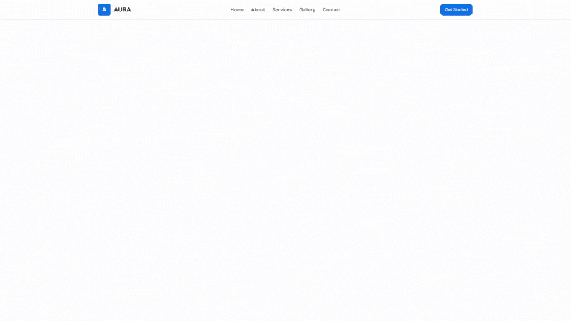

# Aura Landing Page Template

## Live Demo

[View Live Demo](https://aura-landing-template.vercel.app/) <!-- Replace with your actual Vercel URL -->

## Preview



## Description

A modern, animated, and responsive single-page landing template built with cutting-edge frontend technologies. Designed to showcase products, services, or portfolios with a focus on smooth user experience and engaging visuals.

## Features

*   **Hero Section:** Full-height section with animated particle background (`react-tsparticles`), headline, sub-headline, and call-to-action buttons. Uses Framer Motion for entrance animations.
*   **About Section:** Section to describe the product/service, featuring an image and text layout. Uses Framer Motion for scroll-triggered animations.
*   **Services Section:** Displays services using cards, utilizing Heroicons and a grid layout. Uses Framer Motion for scroll-triggered animations on the section and staggered animations for cards.
*   **Gallery Section:** Image gallery section, using `next/image` for optimization and Framer Motion for hover effects and scroll-triggered animations.
*   **Contact Section:** A functional contact form with client-side validation. Uses Framer Motion for scroll-triggered animations.
*   **Navbar:** Sticky navigation bar for easy access to sections.
*   **Footer:** Includes copyright information (dynamic year) and social media links.
*   **Smooth Scrolling:** Implemented using `react-scroll` for navigation between sections.
*   **Responsive Design:** Fully responsive layout adapting to various screen sizes using Tailwind CSS.
*   **Animations:** Subtle entrance and hover animations powered by Framer Motion throughout the page.
*   **HeroUI Components:** Utilizes pre-installed HeroUI components for UI elements like buttons.

## Tech Stack

*   **Framework:** [Next.js](https://nextjs.org/) (App Router)
*   **Language:** [TypeScript](https://www.typescriptlang.org/)
*   **Styling:** [Tailwind CSS](https://tailwindcss.com/)
*   **Component Library:** [HeroUI](https://www.heroui.com/)
*   **Animation:** [Framer Motion](https://motion.dev/)
*   **Particles:** [tsParticles](https://particles.js.org/) / `@tsparticles/react`
*   **Icons:** [Heroicons](https://heroicons.com/)
*   **Social Icons:** [React Social Icons](https://react-social-icons.com/)
*   **Smooth Scrolling:** [React Scroll](https://github.com/fisshy/react-scroll)
*   **Deployment:** [Vercel](https://vercel.com/)
*   **Linting/Formatting:** ESLint (as configured via `eslint.config.mjs`)

## Getting Started

1.  **Clone the repository:**
    ```bash
    git clone https://github.com/BartCodes/aura-landing-template.git # Replace with your repo URL
    cd aura-landing-template
    ```
2.  **Install dependencies:**
    ```bash
    npm install
    # or
    yarn install
    # or
    pnpm install
    ```
3.  **Run the development server:**
    ```bash
    npm run dev
    # or
    yarn dev
    # or
    pnpm dev
    ```
    Open [http://localhost:3000](http://localhost:3000) with your browser to see the result.
